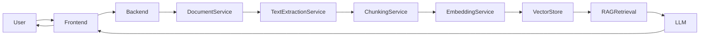

# DocQuery AI

DocQuery AI is a full-stack RAG application for uploading, indexing, and querying documents using embeddings and a retrieval-augmented LLM workflow.

## Overview

The application allows users to upload PDF, DOCX, and TXT files, process them into chunks, generate embeddings, store them in a vector-enabled database, and ask grounded questions using the uploaded content only.

## Features

- JWT-based authentication
- Secure document upload and ownership enforcement
- PDF, DOCX, and TXT text extraction
- Chunking and embedding pipeline
- Vector similarity retrieval
- RAG answer generation with citations
- Dashboard, document management, upload workflow, and chat views
- Docker Compose setup for local development

## Architecture



## Tech Stack

- React + Vite + Tailwind CSS
- Java + Spring Boot
- PostgreSQL + pgvector
- JWT authentication
- Apache PDFBox + Apache Tika

## Setup

1. Copy .env.example to .env and adjust values.
2. Start the backend:
   cd backend && mvn spring-boot:run
3. Start the frontend:
   npm install && npm run dev
4. Open http://localhost:5173

## Docker

```bash
docker-compose up --build
```

## Environment Variables

See [.env.example](.env.example) for required configuration values.

## Project Status

This project includes the full starter structure and the initial working foundations for the RAG application:

- React frontend dashboard and pages
- Spring Boot backend foundation
- JWT/auth scaffolding
- Document and chat API structure
- RAG pipeline configuration and data models

Future incremental work can extend this base with production-grade pgvector integration, real embedding generation, and LLM providers.

## License

MIT
